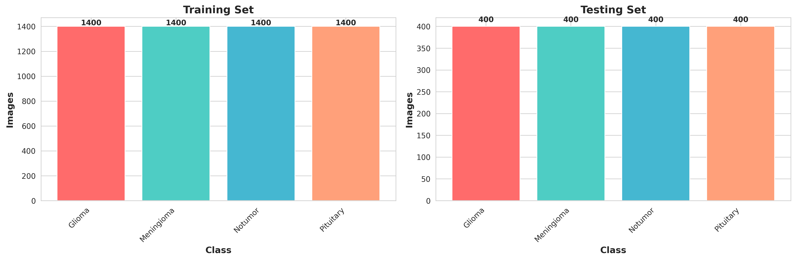
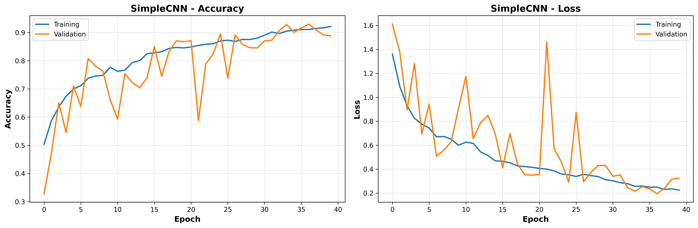
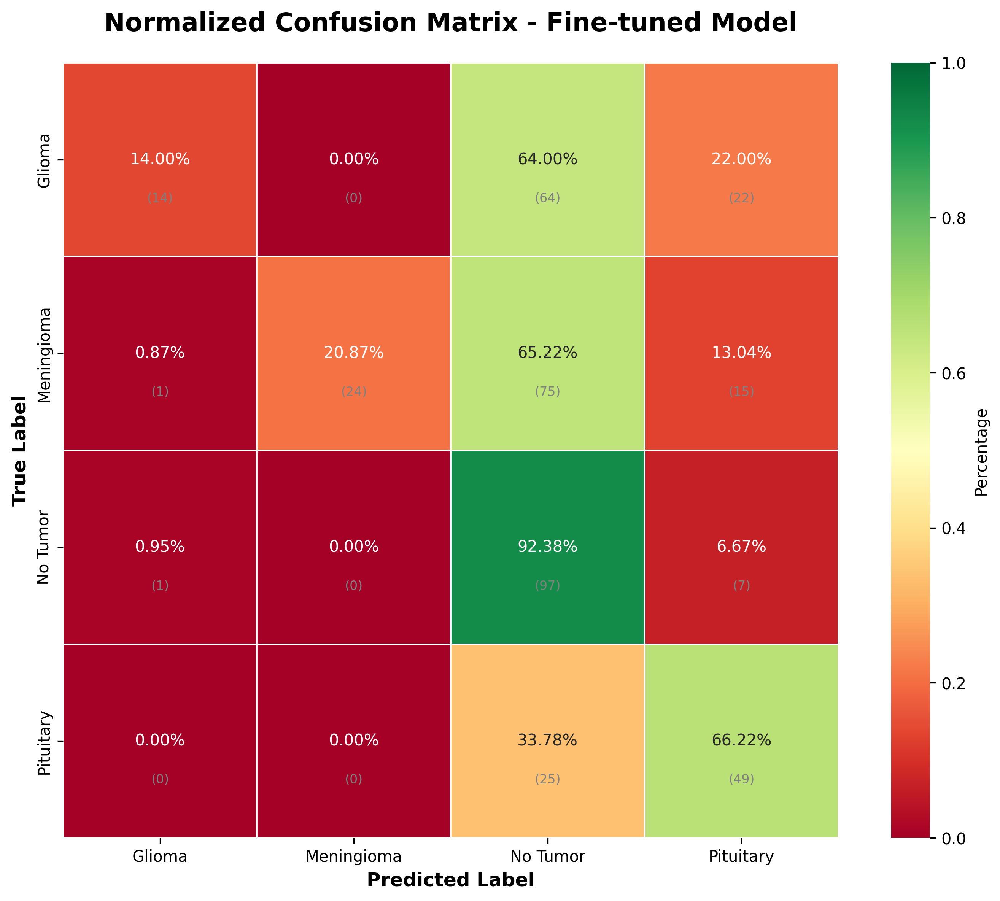

# Brain Tumor Classification

CNN-based classification of brain tumor types from MRI scans.

## Dataset

**Source**: Brain Tumor MRI Dataset (Kaggle)

| Class        | Training | Testing | Total |
|--------------|----------|---------|-------|
| Glioma       | 826      | 100     | 926   |
| Meningioma   | 822      | 115     | 937   |
| No Tumor     | 395      | 105     | 500   |
| Pituitary    | 827      | 74      | 901   |
| **Total**    | **2,870**| **394** | **3,264** |




## Model Architecture

SimpleCNN with 10.7M parameters:
- 3 Convolutional blocks (32, 64, 128 filters)
- Batch Normalization + Dropout
- 2 Dense layers (256, 128 neurons)
- Softmax output (4 classes)

## Results

| Configuration | Accuracy | Loss   | Change  |
|---------------|----------|--------|---------|
| Baseline      | 42.39%   | 3.2599 | -       |
| Fine-tuned    | 46.70%   | 2.8472 | +4.31%  |

**Fine-tuned hyperparameters**: LR=0.0005, Batch=16, Epochs=40

### Per-Class Performance (Fine-tuned)

| Class      | Precision | Recall | F1-Score |
|------------|-----------|--------|----------|
| Glioma     | 1.00      | 0.14   | 0.24     |
| Meningioma | 1.00      | 0.21   | 0.35     |
| No Tumor   | 0.37      | 0.92   | 0.53     |
| Pituitary  | 0.54      | 0.66   | 0.59     |





## Installation

### Using uv (Recommended)

Install [uv](https://github.com/astral-sh/uv) if you haven't already:
```bash
curl -LsSf https://astral.sh/uv/install.sh | sh
```

Then set up the project:
```bash
# Create virtual environment and install dependencies
uv sync

# Activate the environment
source .venv/bin/activate
```

### Using pip (Legacy)

```bash
pip install -r requirements.txt
```

Requirements: TensorFlow, NumPy, Pandas, Matplotlib, Seaborn, Scikit-learn, Pillow

## Usage

### Data Exploration
```bash
# With uv
uv run python scripts/data_exploration.py

# Or with activated venv
python scripts/data_exploration.py
```

### Training
```bash
# With uv
uv run python scripts/train_models.py

# Or with activated venv
python scripts/train_models.py
```
Training time: ~2 hours. Saves model to `models/SimpleCNN_best.h5`.

### Prediction
```bash
# With uv
uv run python scripts/predict_single_image.py data/Testing/glioma_tumor/image.jpg

# Or with activated venv
python scripts/predict_single_image.py data/Testing/glioma_tumor/image.jpg
```

## Project Structure

```
brain-tumor/
├── scripts/              # Python scripts
├── data/                 # MRI images (Training/Testing)
├── models/               # Trained models (.h5)
├── results/              # Plots and metrics
├── pyproject.toml        # UV/Python project configuration
├── requirements.txt      # Legacy pip dependencies
├── setup.sh              # Quick setup script (bash/zsh)
├── setup.fish            # Quick setup script (fish shell)
└── QUICKSTART_UV.md      # UV usage guide
```

## Limitations

- Low accuracy (46.70%) insufficient for clinical use
- Poor glioma detection (14% recall)
- Simple architecture inadequate for medical imaging

## Future Work

- Transfer learning (VGG16, ResNet50)
- Class balancing with weighted loss
- Advanced data augmentation
- Ensemble methods

## License

Educational project.

## This project was developed as part of the course:

Course: INT182 - Data Science and Artificial Intelligence Fundamentals
